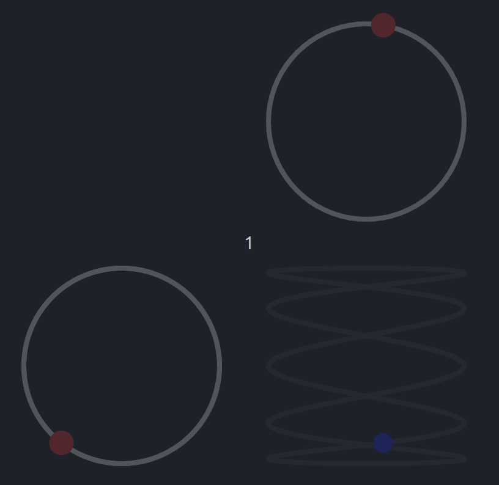
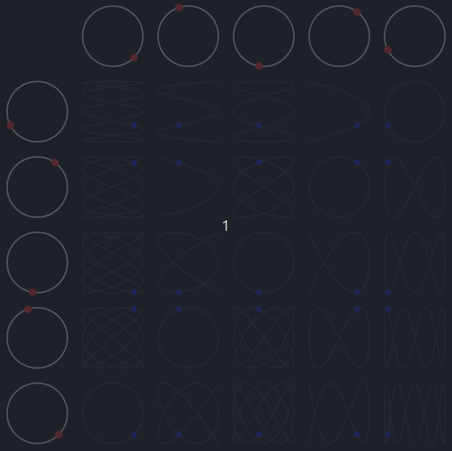

# Simple Harmonic Motion

Using basic trigonometry I was able to describe circles and animate them as you can see below.

----

Combining 2 Circles with different Animation Speeds, we can observe the describing of a new pattern, drawing a whole different figure. 

The combination of the 2 Circles is simple:
 - The new Figure consider the X Coordinate from the Top Circle.
 - The new Figure consider the Y Coordinate from the Left Circle.

----

Dynamically generating Circles & Combinations we can observe the most interesting figures taking form:

